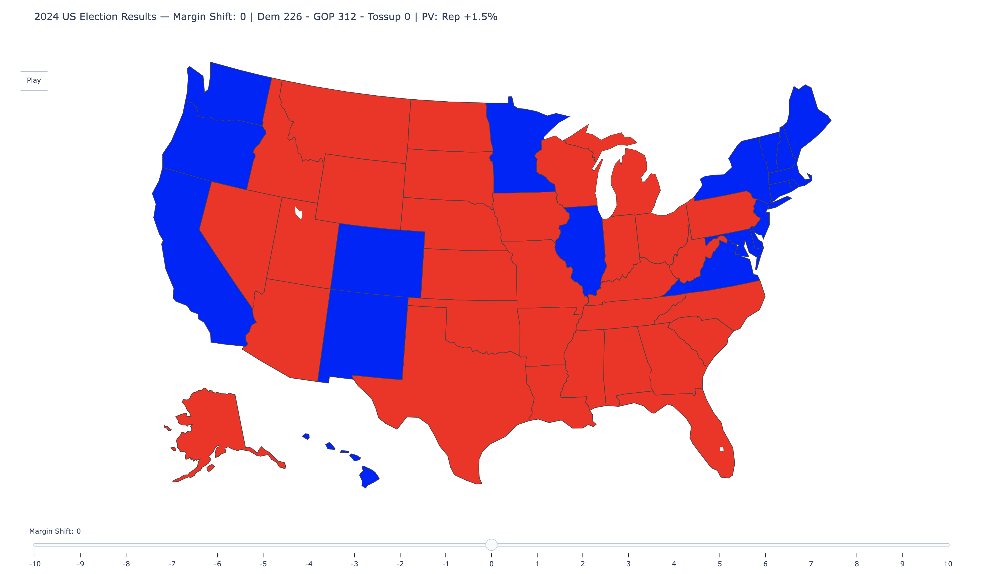

# MyPresidentialElection

An interactive U.S. Presidential Election modeling engine built in Python using Plotly.

This project simulates national vote swings and dynamically recalculates state outcomes and Electoral College totals in real time.



---

# 🎯 Project Goal

Build a flexible election simulation engine that:

* Models all 50 states + DC
* Supports Maine & Nebraska split electoral allocation
* Applies a uniform national swing via interactive slider
* Dynamically updates:

  * State winners
  * Electoral vote totals
  * Margins
* Exports standalone interactive HTML
* Eventually allows:

  * Full state modification
  * Saving scenarios
  * Uploading external datasets
  * Extracting simulation results

The long-term vision is a modular election modeling system that can support multiple election cycles and custom workflows.

---

# 🚀 Phase 1 (Completed)

## ✅ Core Election Engine

* Object-oriented `State` and `Election` classes
* Tracks:

  * Baseline results
  * Simulated results
  * Margin (Dem-positive scale)
  * Winner
  * Electoral Votes
* Clean separation between base data and simulated data

## ✅ Uniform National Swing

* Slider range: -10 to +10 points
* 1-point increments
* Positive shift = Democratic swing
* Negative shift = Republican swing
* Each slider frame:

  * Resets to baseline
  * Applies margin swing
  * Recalculates EV totals

## ✅ Interactive Visualization

* Plotly choropleth map
* Dynamic title showing Electoral Vote totals
* Hover shows:

  * Winner
  * EV
  * Margin
  * Votes
* Play button animates swing across range
* Standalone HTML export:

  * `election_results_map.html`
  * `election_results_map_with_margin.html`

## ✅ Maine & Nebraska Support

* Correctly modeled split electoral allocation:

  * Statewide EV
  * District-level EV
* District rows treated as individual EV units
* Structured to support grouped behavior in later phases

---

# 🧠 Architecture

## State Model

Each `State` object stores:

* `base_results`
* `results`
* `unit_type` (statewide or district)
* `parent_state` (for ME/NE grouping)

Supports:

* Vote shift
* Margin shift
* Reset to baseline
* Winner recalculation

---

## Election Engine

Handles:

* CSV parsing
* EV aggregation
* Popular vote margin
* Tipping point state
* Electoral College bias
* Simulation methods
* Visualization generation

---

# 📁 Project Structure

```
├── data/
│   └── 2020.csv
├── src/
│   ├── __init__.py
│   ├── constants.py
│   ├── election.py
│   └── state.py
├── main.py
├── election_results_map.html
├── election_results_map_with_margin.html
└── README.md
```

---

# 🔮 Phase 2 (In Progress)

## 🗳 Multi-Election Support

* Add toggle between:

  * 2020
  * 2024
* Dynamic loading of election datasets
* Single visualization engine supporting multiple years

## 🎛 Full State Modification

* Allow all states (including ME/NE districts) to be modified via slider
* Group-based swing logic for split states
* Consistent swing behavior across statewide + districts

## 📊 Scenario Saving

* Save custom swing scenarios
* Export simulation results to structured format (JSON / CSV)
* Load saved scenarios

## 📥 Data Source

Current CSV files (`2020.csv`, `2024.csv`) were manually sourced from Wikipedia election results pages and formatted to match the engine's expected schema:

```
State, EV, Democratic, Republican, Other
```

> **Stretch Goal:** `scripts/build_year_csv.py` is a placeholder script for automating this process via an external dataset. Not yet implemented — see Phase 3.

---

# 🗄 Phase 3 (Planned)

## 📥 Automated Data Pipeline *(Stretch Goal)*

* Automate CSV generation via an external election dataset
* `scripts/build_year_csv.py` is the placeholder — wire up a reliable data source
* Extend coverage back to earlier election cycles (2012, 2008, and beyond)
* Consistent CSV schema across all years for drop-in engine compatibility

## 🧱 Database Integration

* Introduce PostgreSQL (or similar relational database)
* Store:

  * Election cycles
  * State-level results
  * Saved scenarios
* Separate data storage from simulation engine

## 🌐 Backend Refactor

* Modularize simulation logic
* Expose API endpoints
* Support external data ingestion
* Enable structured result retrieval

## 📈 Advanced Modeling

* Polling data ingestion
* Scenario comparison
* Historical election analysis
* Performance optimization

---

# 🛠 Technologies

* Python 3.8
* Pandas
* Plotly
* Object-Oriented Design

Planned:

* PostgreSQL
* Backend API layer

---

# 🔍 What This Project Covers

## 🧱 Election Modeling

* State-level electoral vote aggregation
* Split allocation modeling (Maine & Nebraska)
* Margin-based winner determination
* Popular vote vs Electoral College comparison
* Tipping point state identification
* Electoral College bias calculation

---

## 🎛 Simulation Engine

* Baseline vs simulated result tracking
* Uniform national margin swing
* State-level vote and margin adjustment methods
* Reset-to-baseline frame generation
* Deterministic recalculation per slider step

---

## 📊 Visualization Layer

* Interactive Plotly choropleth map
* Dynamic electoral vote totals in title
* Hover metadata display (EV, margin, votes)
* Frame-based animation (slider + play button)
* Standalone HTML export

---

## 🗄 Extensible Architecture

* Multi-election dataset support (planned)
* Modular State and Election classes
* Designed for future database integration
* Designed for scenario saving and data workflows

---

# 🧪 How to Run

```bash
pip install -r requirements.txt
python main.py
```

Open:

```
election_results_map_with_margin.html
```

---

# 📌 Current Status

*  Phase 1: Complete
*  Phase 2: Multi-year support + full modification logic
*  Phase 3: Database integration and backend modularization

---
