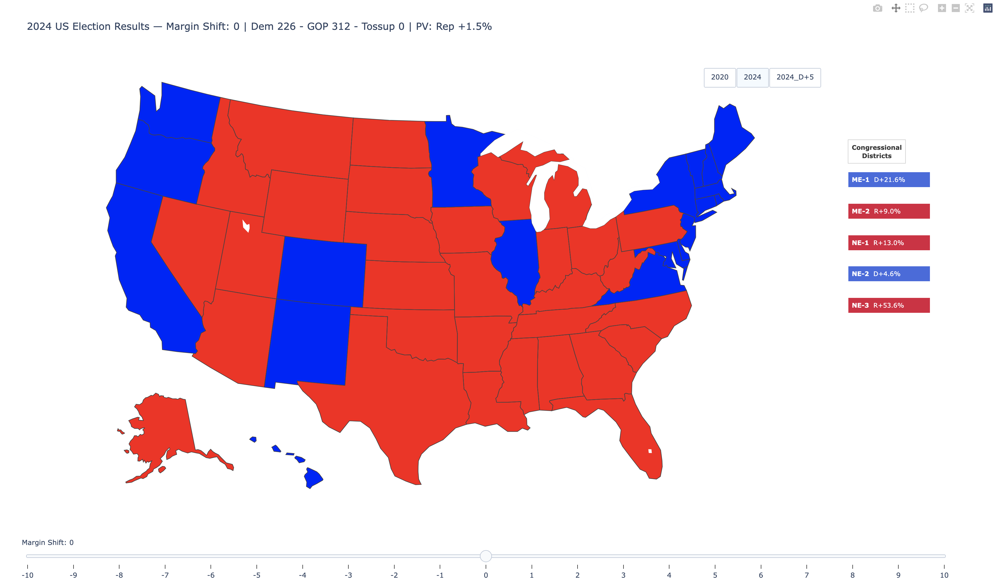

# MyPresidentialElection

An interactive U.S. Presidential Election modeling engine built in Python and Plotly. Simulates national and state-level vote swings with real-time Electoral College recalculation — exported as a fully standalone interactive HTML file.



---

# 🎯 Project Goal

Build a flexible, multi-cycle election simulation engine that models all 50 states + DC, supports Maine & Nebraska split electoral allocation, and allows users to explore vote swing scenarios interactively. The long-term vision is a modular system with a backend API, database storage, and automated data pipelines.

---

# 🛠 Technologies

* Python 3.8 · Pandas · Plotly · Object-Oriented Design · JavaScript (vanilla)

Planned: PostgreSQL · Backend API layer

---

# 📁 Project Structure

```
├── data/                        # Election CSVs (2020, 2024)
├── scenarios/                   # Exported scenario files
├── src/
│   ├── model/
│   │   ├── election.py          # Election engine
│   │   ├── state.py             # State model
│   │   └── constants.py         # State abbreviation mappings
│   ├── visualization/
│   │   └── visualize.py         # Plotly visualization layer
│   └── static/js/
│       ├── per_state_control.js # In-browser interaction logic
│       └── utils.js             # JS utility functions
├── tests/
│   ├── test_election.py         # Election class unit tests
│   └── test_state.py            # State class unit tests
├── main.py
└── election_results_map_with_margin.html
```

---

# 🧪 How to Run

```bash
pip install -r requirements.txt
python main.py
```

Open `election_results_map_with_margin.html` in any browser.

---

# 🚀 Phase 1 (Complete)

Built the core engine and interactive visualization from scratch.

* **Election engine** — object-oriented `State` and `Election` classes with clean separation between baseline and simulated data
* **National swing slider** — ±10 point range, dynamically recalculates state winners and Electoral College totals on each step
* **Interactive choropleth map** — hover shows winner, EV, margin, and vote counts; exports as a standalone HTML file
* **Maine & Nebraska support** — correctly models split electoral allocation at both the statewide and district level

---

# 🏁 Phase 2 (Complete)

Expanded the engine to support multiple election years, scenario workflows, and per-state swing control.

## ✅ Multi-Election Year Toggle

Supports toggling between 2020 and 2024 (or any imported year) within a single HTML page. The `Election` class accepts a year string or CSV path with automatic presidential year validation.

## ✅ Scenario Save & Import

Export any simulated state to CSV or JSON via `export_scenario()`. Import any compatible CSV directly in the browser — it registers as a new year toggle button on the map. Exported files are drop-in compatible with the engine's data schema.

## ✅ Per-State Individual Control

Click any state on the map to open a floating swing panel with an independent ±10 point slider. EV totals, popular vote margin, and tipping point update in real time. A **mode toggle bar** below the map switches between:

* **Map Swing** — national slider shifts all states together
* **State Swing** — national slider locked; click any state to adjust it individually

> **Note:** Combining a national swing with per-state overrides simultaneously was not achievable within Plotly's pre-computed frame rendering model. The two modes are intentionally kept separate. Unified control is deferred to Phase 4 where it will be built natively as part of a React frontend.

---

# 🔧 Phase 3 (In Progress)

Completes the simulation engine with historical data coverage, analytical depth, and test coverage.

## ✅ Historical Data Pipeline

Normalized and integrated election results for 2000, 2004, 2008, 2012, and 2016 into the existing multi-year framework. Extends the year toggle to cover six cycles (2000–2024) and includes a reusable ingestion script (`scripts/build_year_csv.py`) for adding future election years.

State-level vote totals are sourced from the **MIT Election Data + Science Lab** — *U.S. President 1976–2020* dataset (Harvard Dataverse, [doi:10.7910/DVN/42MVDX](https://doi.org/10.7910/DVN/42MVDX)). Congressional district results for Maine and Nebraska (ME-1, ME-2, NE-1, NE-2, NE-3) are sourced manually from Wikipedia state election result pages and cross-referenced against certified state totals.

## 🔲 Electoral College Bias Display

Surface the existing `get_ec_bias()` calculation into the interactive map. Shows how much the Electoral College structurally favors one party over the popular vote, and identifies the tipping point state responsible for that bias.

## 🔲 Scenario Comparison

Add the ability to compare two election scenarios side by side — for example, 2020 vs 2024, or a baseline year against a simulated swing. Extends the simulation engine with a dedicated comparison layer.

## 🔲 Unit Test Coverage

Expand the test suite from placeholder tests to meaningful coverage of the simulation engine — margin swing, tipping point calculation, EC bias, reset behavior, and edge cases.

---

# 🚀 Phase 4 (Stretch Goals)

Future work beyond Phase 3 completion. No timeline set.

* **Unified Swing Control** *(deferred from Phase 2)* — replace Plotly's slider with a custom range input so national and per-state swings work simultaneously; planned as a React component
* **React Frontend** — rebuild the interactive map as a hosted web application with a Flask backend API
* **Database Integration** — PostgreSQL storage for election cycles, saved scenarios, and historical results
* **Backend API** — Flask endpoints wrapping the simulation engine for external data ingestion and scenario retrieval

---

# 🔍 What This Project Covers

**Election Modeling** — state-level EV aggregation, split allocation for Maine & Nebraska, margin-based winner determination, popular vote vs Electoral College comparison, tipping point state identification, and Electoral College bias calculation.

**Simulation Engine** — baseline vs simulated result tracking, uniform national margin swing, per-state vote and margin adjustment, reset-to-baseline on each frame, and deterministic recalculation per slider step.

**Visualization Layer** — interactive Plotly choropleth map with dynamic EV totals, hover metadata, frame-based margin slider, and fully standalone HTML export.

**Extensible Architecture** — modular `State` and `Election` classes, multi-year dataset support, scenario save/load workflows, and designed for future database and API integration.

---

# 📌 Current Status

* ✅ Phase 1: Complete
* ✅ Phase 2: Complete — per-state individual control delivered with mode toggle; unified swing deferred to Phase 4
* 🔧 Phase 3: In Progress — historical data pipeline, EC bias display, scenario comparison, unit test coverage
* 🚀 Phase 4: Stretch goals — React frontend, Flask API, database integration, unified swing control

---
